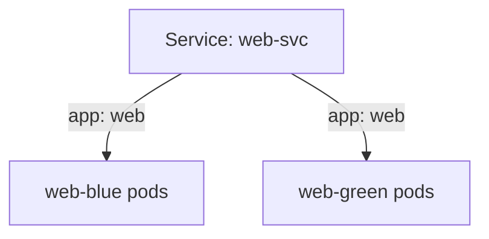

# How A Service Finds Its Pods

Before you switch any traffic, you need one clear picture: how a Service decides which pods get its traffic. A Service does not point to a Deployment by name. It points to pods by their labels.

This part shows that picture on the two versions of a web app, and the commands that let you see it on a live cluster.

## The blue and the green fleet

The example in this module is a small web app with two versions on the planet (namespace) `venus`. Each version is its own Deployment, and one Service sits in front of both.

### The objects

These are the objects, all in the namespace `venus`:

| Object | Namespace | Purpose |
| --- | --- | --- |
| Deployment `web-blue` | `venus` | Runs the blue version of the web app |
| Deployment `web-green` | `venus` | Runs the green version of the web app |
| Service `web-svc` | `venus` | Routes traffic to matching Pods |

### The labels

Labels are short `key=value` tags on an object, like markings painted on a ship's hull. Each Deployment puts labels on the pods it creates, through its pod template. The important labels are:

| Workload | Pod labels |
| --- | --- |
| `web-blue` | `app=web`, `version=blue` |
| `web-green` | `app=web`, `version=green` |

Both versions share `app=web`. Only the `version` label tells them apart.

## The selector decides

A Service is like a beacon: one call sign that a whole group of ships answers to. Its **selector** is the beacon's rule: which hull markings a ship needs to answer. A pod must carry every label in the selector to be chosen.

### A selector that matches both versions

The Service starts with this selector:

```yaml
selector:
  app: web
```

That selector matches both blue and green Pods, because both Deployments create Pods with `app=web`:



The beacon calls `app: web`, and every ship with that marking answers, blue and green alike.

### A selector that matches one version

To route to only one version, the Service needs a more specific selector, one that also names the version. For example, to route only to green:

```yaml
selector:
  app: web
  version: green
```

Now a pod needs both `app=web` and `version=green`. The blue pods have the first label but not the second, so the Service leaves them out. They keep running; they just get no traffic from this Service.

## The endpoints show where traffic really goes

You do not have to guess which pods a Service picked. Kubernetes writes the answer down for you.

### Who keeps the list

The **endpoints** of a Service are its list of pod addresses (IP addresses) that can get traffic: the beacon's current list of ships that answer it. You never edit this list. The endpoints controller, a part of the Kubernetes control plane, watches the pods and rebuilds the list every time a matching pod appears, disappears, or becomes ready or not ready. That is why a selector change takes effect within seconds.

Only ready pods are listed. If the list is empty, the selector matches no ready pod: either the labels do not match, or the pods are not ready yet.

### The commands that show it

These four commands show the whole picture. Run them before you change anything, every time. In the graded mission you run them on the `venus` planet.

List the pods with their labels:

```sh
kubectl -n venus get pods --show-labels
```

Read the Service, and look at `spec.selector`:

```sh
kubectl -n venus get service web-svc -o yaml
```

List the Service's endpoints:

```sh
kubectl -n venus get endpoints web-svc
```

For a more detailed view of the Service, including its endpoints and events:

```sh
kubectl -n venus describe service web-svc
```

From Kubernetes 1.33, `kubectl get endpoints` prints a warning that the v1 Endpoints API is deprecated in favour of EndpointSlices. The command still works and still shows the right addresses.

### Think it through

Before you change a Service in a task, answer these five questions:

1. Which object receives traffic from clients?
2. Does a Service select a Deployment name or Pod labels?
3. Which labels are shared by both versions?
4. Which label separates blue from green?
5. After the switch, should green Pods still exist?

The reasoning: the Service receives the traffic. It selects pods by their labels. `app=web` is shared by both versions, and `version=blue` and `version=green` separate them. The green pods can still exist after a switch to blue; they just should not get traffic from this Service.

> [!TIP]
> Never guess labels from object names. A Deployment called `web-green` could put any labels on its pods. Always check with `--show-labels` first.

## Common pitfalls

> [!WARNING]
> - **Setting the Service selector to the Deployment name.** A selector reads pod labels; the Deployment's name means nothing to it.
> - **Forgetting that endpoints point to Pods.** They never point to ReplicaSets or Deployments.
> - **Reading the labels on the Deployment instead of the pods.** The labels that count are the pod template's labels, which you see with `kubectl get pods --show-labels`.
> - **Thinking an empty endpoints list means the Service is broken.** It means no ready pod matches the selector. Compare the selector with the pod labels.
