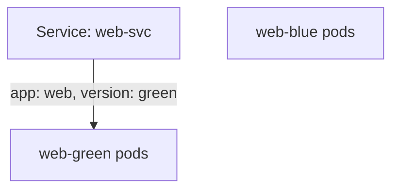

# Update One Version And Switch The Traffic

A blue-green task usually has two moves: change one version, and then swing the traffic. Each move is one `kubectl` command, and each one changes a different object. This part shows both, and how to prove the result.

## Change the image of one version

The first move changes only one Deployment. The other version keeps running as it is, so you always have a working fleet to fall back on.

### Send a new blueprint to one fleet order

A container image is the ship's blueprint, and its tag (for example `1.31-alpine`) is the version stamp. `kubectl set image` sends a new blueprint version to one fleet order (Deployment):

```text
kubectl -n <namespace> set image deployment/<deployment> <container>=<image>
```

- `deployment/<deployment>` names the target Deployment.
- `<container>=<image>` means "set the container with this name to this image". The name on the left is the container's name inside the pod, not the Deployment's name.
- Changing the image changes the Deployment's pod template, so the Deployment starts a rollout: it builds new pods with the new image and removes the old ones.

Then wait until the rollout is done:

```text
kubectl -n <namespace> rollout status deployment/<deployment>
```

### Check the image

Read the image straight from the Deployment with a JSONPath query (a way to print one field of an object):

```text
kubectl -n <namespace> get deployment <deployment> \
  -o jsonpath='{.spec.template.spec.containers[0].image}{"\n"}'
```

If you are not sure of the container's name, print all of them:

```text
kubectl -n <namespace> get deployment <deployment> \
  -o jsonpath='{.spec.template.spec.containers[*].name}{"\n"}'
```

## Swing the beacon

The second move changes the Service, not the Deployments. You add the version label to the selector, so only one version matches.

### Patch the selector

`kubectl patch` sends a correction to one part of an object. For example, to send all traffic of `web-svc` to the green version:

```text
kubectl -n venus patch service web-svc \
  -p '{"spec":{"selector":{"app":"web","version":"green"}}}'
```

The patch changes `spec.selector` and nothing else. The Service now requires both labels to match, so pods of the other version drop out of its endpoints. The endpoints controller in the Kubernetes control plane does that within seconds; you do not restart anything.

You can also make the same change with `kubectl edit service web-svc` and type the extra label under `spec.selector` yourself. The result is the same.



After the patch, the beacon calls only ships with both markings. The other fleet still flies, but no signal reaches it through this Service.

### Prove the switch

Check the selector with a JSONPath query:

```text
kubectl -n <namespace> get service <service> \
  -o jsonpath='{.spec.selector}{"\n"}'
```

Then compare the endpoints with the addresses of each version's pods. `-l` filters by label, and `-o wide` adds the pod IP address:

```text
kubectl -n <namespace> get endpoints <service>
kubectl -n <namespace> get pods -l app=web,version=blue -o wide
kubectl -n <namespace> get pods -l app=web,version=green -o wide
```

The endpoint addresses must match the pods of the version you chose, and none of the others.

## When it does not work

Most problems in this task come from a selector and labels that do not agree. Look before you change anything again.

### The Service has no endpoints

Compare the selector with the pod labels:

```text
kubectl -n <namespace> get service <service> -o jsonpath='{.spec.selector}{"\n"}'
kubectl -n <namespace> get pods --show-labels
```

The Service selector must match labels on ready Pods. If even one selector key does not match, the Pod is excluded.

### The wrong version still gets traffic

Check whether the selector is still too broad with `kubectl get service <service> -o yaml`. If the selector is only `app=web`, it still matches both versions.

### The image did not change

`kubectl set image` needs the correct container name on the left side of `=`. Print the container names with the JSONPath query above and try again.

> [!TIP]
> If only one image needs changing, `kubectl set image` is usually faster than editing YAML. On the exam, every minute you save on typing is a minute for checking.

## Common pitfalls

> [!WARNING]
> - **Updating the wrong Deployment.** Read the task twice: it names the one version to change.
> - **Deleting the other version.** A blue-green switch stops traffic to a version; it does not remove it. The task usually wants it kept as a fallback.
> - **Patching labels on the Service metadata instead of `spec.selector`.** Labels in `metadata.labels` describe the Service itself and select nothing.
> - **Trusting the command instead of the result.** Always check the selector and the endpoints after the change.

## Your mission: Blue-Green Service Switch Lab

You can now read a Service's selector and endpoints, change one version's image, and swing the Service to one version. Your mission: on the planet `venus`, update the green version's image and then send all of `web-svc`'s traffic to the blue version, keeping green running.

Start the mission:

```sh
astrona run --git ssh://git@github.com/astrona-io/ATS001.git -c sections/section-010/module-01/labs/lab-01
```

Read the task in [`question.md`](./labs/lab-01/question.md) and solve it on your own first. When you think you are done, send it for grading:

```sh
astrona submit -c sections/section-010/module-01/labs/lab-01
```

When the mission is done, remove it:

```sh
astrona destroy ast001-lab-010
```
