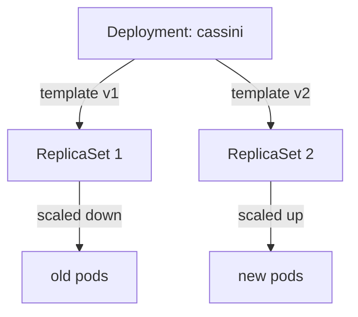

# What Starts A Rollout

A Deployment does not replace its pods every time you change it. It replaces them only when the part that describes the pods changes. This part shows which part that is, on a live Deployment, and where Kubernetes records each change.

## The fleet order and its ship design

A Deployment is like a fleet order: "keep this many ships of this design flying". The design part has its own name, and only a change there builds new ships.

### The pod template

Inside every Deployment is a **pod template**, the field `spec.template`. It is the ship design: the labels, containers, images, environment variables and ports of every pod. Fields outside it, such as `spec.replicas` or `spec.strategy`, are about the fleet, not about each ship.

When the pod template changes, the Deployment controller (a part of the Kubernetes control plane) starts a **rollout**: it creates a new **ReplicaSet**, a batch of pods built from the new design, and scales the old one down. Changing the Deployment strategy alone does not create a new ReplicaSet.

For example, `kubectl set env` changes `.spec.template.spec.containers[].env`, so Kubernetes creates a new ReplicaSet. An environment variable is like a note pinned up in the cockpit that the crew reads at launch: a new note means new ships.



Each version of the pod template gets its own ReplicaSet. During a rollout, the Deployment controller scales the new one up and the old one down.

## Create the starting fleet

Now see it on a live Deployment. You create the planet `mercury` and a Deployment `cassini` with 4 replicas.

### Save and apply the Deployment

Save this as `deployment-cassini.yaml`:

```yaml
apiVersion: v1
kind: Namespace
metadata:
  name: mercury
---
apiVersion: apps/v1
kind: Deployment
metadata:
  name: cassini
  namespace: mercury
spec:
  replicas: 4
  selector:
    matchLabels:
      app: cassini
  template:
    metadata:
      labels:
        app: cassini
    spec:
      containers:
        - name: app
          image: nginx:1.31-alpine
          ports:
            - containerPort: 80
```

Apply it:

```sh
kubectl apply -f deployment-cassini.yaml
```

Then check the result. This waits until all 4 pods are ready:

```sh
kubectl -n mercury rollout status deployment/cassini
```

### Inspect the starting state

Before you solve any task, look at what already exists. This builds the habit you need during the exam.

```sh
kubectl -n mercury get deployment cassini -o yaml
kubectl -n mercury get replicasets
kubectl -n mercury rollout history deployment/cassini
```

Look for these details:

- Correct namespace
- Existing labels and selectors
- Current images, replicas, ports, or mounted resources
- Events that explain pending, failed, or rejected resources

`get replicasets` shows one ReplicaSet, because the pod template has had only one version. `rollout history` is the fleet order's logbook: one numbered revision per pod template that was flown.

## A way to read any task

Most CKAD tasks about Deployments can be read the same way. A useful way to read any CKAD task is:

1. Find the namespace.
2. Identify the Kubernetes object type.
3. Decide whether the change belongs to metadata, spec, Pod template, or container spec.
4. Apply the smallest correct change.
5. Verify with `kubectl get`, `describe`, logs, events, or JSONPath.

Step 3 is the one that decides whether a rollout happens. A change in the pod template or the container spec rolls out new pods; a change in metadata or the rest of `spec` does not.

> [!TIP]
> Use `kubectl explain` if you are unsure where a field belongs. For example, `kubectl explain deployment.spec.strategy` shows the field and what it means.

## Common pitfalls

> [!WARNING]
> - **Expecting a rollout from a strategy change.** Changing `spec.strategy` alone creates no new ReplicaSet. Only a change to the pod template does.
> - **Editing the live Pod instead of the Deployment.** The Deployment rebuilds pods from its own template, so your change is lost.
> - **Forgetting `-n mercury`.** Without it, `kubectl` looks in the `default` namespace and finds nothing.
