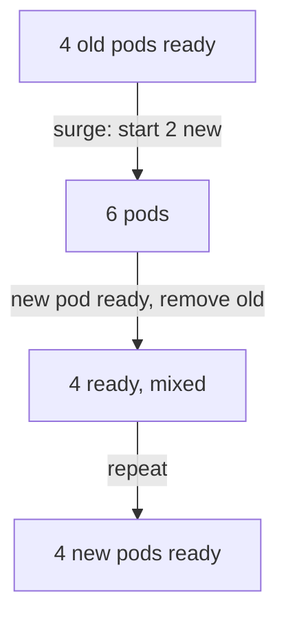

# Roll Out With Zero Downtime

A rolling update swaps old pods for new ones a few at a time. Two numbers in the Deployment decide how many at a time, and whether the app ever has fewer pods than it should. This part sets those numbers on `cassini` in the namespace `mercury`, starts a rollout and proves it.

The commands below need the `cassini` Deployment with 4 replicas in `mercury`, created from `deployment-cassini.yaml`.

## The two numbers that set the pace

Deployments roll out ReplicaSet changes gradually. Two fields under `spec.strategy.rollingUpdate` control the pace:

- `maxSurge` controls how many extra Pods may exist during rollout: how many extra ships may be in the sky during the swap.
- `maxUnavailable` controls how many desired Pods may be unavailable: how many of the ordered ships may be out of service at once.

### Work out the numbers

With `replicas: 4`, `maxSurge: 2` permits as many as 6 Pods during the rollout. `maxUnavailable: 0` tells Kubernetes not to voluntarily reduce available Pods below 4.

So the Deployment controller first starts up to 2 new pods. Only when a new pod is ready does it remove an old one. The app never has fewer than 4 ready pods: that is zero downtime.



The count of ready pods never drops below 4, and the total never goes above 6.

### Think it through

Before you change anything, answer these three questions:

- How many desired replicas exist?
- How many extra Pods are allowed?
- What Pod template change triggers rollout?

## The task

This is the task you solve in this part. Rewrite it as a short checklist in your notes, with the object and field you expect to change for each item.

For Deployment `cassini` in namespace `mercury`:

- Keep `4` replicas.
- Allow up to `2` extra Pods during rollout.
- Allow `0` unavailable Pods.
- Trigger a rollout by setting container environment variable `APP_VERSION=2`.

The first three items belong to the Deployment's `spec.strategy`. The last one belongs to the pod template, so it is the one that starts the rollout.

## Set the strategy and roll out

Order matters here. Set the pace first, then start the rollout, so the new pace is used.

### Patch the rolling update strategy

Patch the rolling update strategy:

```bash
kubectl -n mercury patch deployment cassini -p '{
  "spec": {
    "strategy": {
      "type": "RollingUpdate",
      "rollingUpdate": {
        "maxSurge": 2,
        "maxUnavailable": 0
      }
    }
  }
}'
```

This changes only the strategy. No new pods start yet, because the pod template did not change.

### Trigger the rollout

Trigger the rollout:

```bash
kubectl -n mercury set env deployment/cassini APP_VERSION=2
kubectl -n mercury rollout status deployment/cassini
```

`kubectl set env` adds the variable to the container in the pod template. The Deployment controller sees a new template, creates a new ReplicaSet and swaps the pods, never going below 4 ready pods. `rollout status` waits until the swap is done.

## Prove the result

A command that succeeds is not proof. Read the live object.

### Check the strategy, the variable and the history

```bash
kubectl -n mercury get deploy cassini -o jsonpath='{.spec.strategy}{"\n"}'
kubectl -n mercury get deploy cassini -o jsonpath='{.spec.template.spec.containers[0].env}{"\n"}'
kubectl -n mercury rollout history deployment/cassini
```

The strategy shows `maxSurge` 2 and `maxUnavailable` 0, the container has `APP_VERSION` set to `"2"`, and the history has a new revision. `kubectl -n mercury get replicasets` now shows two ReplicaSets: the old one at 0 pods and the new one at 4.

When verification fails, do not immediately rerun the solution. First compare the live object with the expected object.

### The same end state as a file

You can also write the whole end state as one file and apply it. Use this when you start again from a fresh cluster, or to compare with your live object. Save this as `deployment-cassini-zero-downtime.yaml`:

```yaml
apiVersion: apps/v1
kind: Deployment
metadata:
  name: cassini
  namespace: mercury
spec:
  replicas: 4
  strategy:
    type: RollingUpdate
    rollingUpdate:
      maxSurge: 2
      maxUnavailable: 0
  selector:
    matchLabels:
      app: cassini
  template:
    metadata:
      labels:
        app: cassini
    spec:
      containers:
        - name: app
          image: nginx:1.31-alpine
          env:
            - name: APP_VERSION
              value: "2"
          ports:
            - containerPort: 80
```

Apply it:

```sh
kubectl apply -f deployment-cassini-zero-downtime.yaml
```

If you already ran the two commands above, nothing changes: the live object already matches the file.

## When it does not work

- If no new ReplicaSet appears, confirm you changed the Pod template, not only Deployment metadata.
- If rollout stalls, inspect Pod readiness and events (`kubectl -n mercury describe pod <pod>`).

> [!TIP]
> Prefer fast imperative commands when they produce the correct object, but switch to YAML when field placement matters. A strategy patch is easy to get wrong by one level of nesting; check it with JSONPath every time.

## Common pitfalls

> [!WARNING]
> - **Setting `maxUnavailable: 1`.** That lets the app drop to 3 ready pods, which violates zero downtime.
> - **Editing the live Pod instead of the Deployment.** The Deployment rebuilds the pod from its template.
> - **Forgetting to trigger a new rollout after changing the strategy.** The strategy only matters once the pod template changes.
