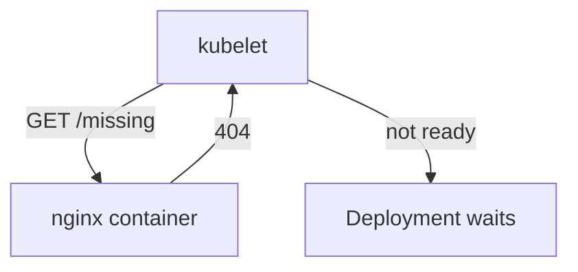

# Build A Rollout History

A rollback goes back to an earlier revision, so there must be an earlier revision to go back to. This part builds a short history on purpose: first a version that works, then one that never comes online. On the way you see why the second one gets stuck.

## The pre-flight check

A Deployment only counts a new pod as done when the pod is **ready**. Kubernetes decides that with a readiness probe.

### What a readiness probe does

A **readiness probe** is a test that the kubelet (the agent on each node) runs against a container again and again. Think of it as a pre-flight check: mission control sends signals to a ship only after it passes. While the probe fails, the pod is not ready: it gets no Service traffic, and the Deployment does not count it as available.

The Deployment in this module asks nginx for the path `/missing` on port `80`. That page does not exist, so nginx answers with an error, the probe fails every time, and the pods never become ready. The rollout may fail because the readiness probe is intentionally bad.



The kubelet asks for a page that does not exist, gets an error back, and keeps the pod not ready, so the Deployment keeps waiting.

## Make a working revision first

To create a rollback history in a fresh cluster, first apply a working version, then apply the broken version. The working version below is the same Deployment with one difference: the readiness probe asks for `/`, the nginx welcome page, which exists.

### Save and apply the working version

Save this as `deployment-api-new-c32-working.yaml`:

```yaml
apiVersion: v1
kind: Namespace
metadata:
  name: aspen
---
apiVersion: apps/v1
kind: Deployment
metadata:
  name: api-new-c32
  namespace: aspen
spec:
  replicas: 2
  selector:
    matchLabels:
      app: api-new-c32
  template:
    metadata:
      labels:
        app: api-new-c32
    spec:
      containers:
        - name: api
          image: nginx:1.31-alpine
          readinessProbe:
            httpGet:
              path: /
              port: 80
            initialDelaySeconds: 2
            periodSeconds: 3
```

Apply it:

```sh
kubectl apply -f deployment-api-new-c32-working.yaml
```

Then check the result. This rollout finishes, because the probe passes:

```sh
kubectl -n aspen rollout status deployment/api-new-c32
```

## Apply the broken version

Now apply the version whose readiness probe asks for `/missing`. It becomes revision 2 in the logbook.

### Save and apply the broken version

Save this as `deployment-api-new-c32.yaml`:

```yaml
apiVersion: v1
kind: Namespace
metadata:
  name: aspen
---
apiVersion: apps/v1
kind: Deployment
metadata:
  name: api-new-c32
  namespace: aspen
spec:
  replicas: 2
  selector:
    matchLabels:
      app: api-new-c32
  template:
    metadata:
      labels:
        app: api-new-c32
    spec:
      containers:
        - name: api
          image: nginx:1.31-alpine
          readinessProbe:
            httpGet:
              path: /missing
              port: 80
            initialDelaySeconds: 2
            periodSeconds: 3
```

Apply it, and wait at most 20 seconds for the rollout:

```bash
kubectl apply -f deployment-api-new-c32.yaml
kubectl -n aspen rollout status deployment/api-new-c32 --timeout=20s
```

This time `rollout status` gives up after 20 seconds, because the new pod never becomes ready. The Deployment controller keeps the old, working pods running while it waits.

### Inspect the starting state

Before solving, inspect what already exists. This builds the habit you need during the exam.

```bash
kubectl -n aspen rollout status deployment/api-new-c32
kubectl -n aspen rollout history deployment/api-new-c32
kubectl -n aspen get replicasets
```

Look for these details:

- Correct namespace
- Existing labels and selectors
- Current images, replicas, ports, or mounted resources
- Events that explain pending, failed, or rejected resources

The first command waits again, so press Ctrl+C to stop it once you have seen it is stuck. The history lists two revisions, and `get replicasets` shows one ReplicaSet for each.

## Common pitfalls

> [!WARNING]
> - **Expecting a crash.** A failing readiness probe does not restart the container or show an error status. The pod runs but is never ready, so look at the `READY` column and the events.
> - **Starting with only the broken version.** On a fresh cluster there is then no earlier revision, and there is nothing to roll back to.
> - **Thinking the app is down.** While the rollout is stuck, the old pods still serve traffic. The upgrade is what is broken.
