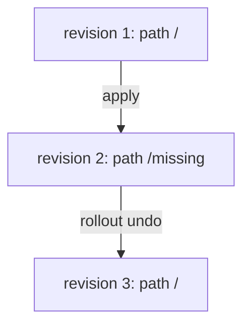

# Roll Back To A Working Revision

When a rollout never comes online, you do not fix it by hand under pressure. You go back to the last design that worked, then look at the broken one calmly. This part rolls `api-new-c32` in the namespace `aspen` back to its working revision and proves it.

The commands below need the `api-new-c32` Deployment with two revisions: a working one and one whose readiness probe asks for `/missing`.

## The task

Deployment `api-new-c32` in namespace `aspen` has a recent update that never came online. Check rollout history and roll back to a working revision.

### Think it through

Before you look at the commands, answer these three questions:

- Is the current rollout complete?
- Which revision introduced the problem?
- Should you undo latest or target a specific revision?

Rewrite the task as a short checklist in your notes. For each item, write the object and field you expect to change.

## Go back in the logbook

`kubectl rollout undo` tells the Deployment controller to take the pod template of an earlier revision and roll it out again. It changes the Deployment Pod template back to an older revision. Check history first so you understand which revision is broken and which revision is likely working.



An undo does not delete revision 2. It copies the template of revision 1 into a new revision, number 3, and the old number 1 drops out of the list.

### Undo the last rollout

```bash
kubectl -n aspen rollout history deployment/api-new-c32
kubectl -n aspen rollout undo deployment/api-new-c32
kubectl -n aspen rollout status deployment/api-new-c32
```

Without options, `undo` goes back one revision. This time `rollout status` finishes, because the restored pods pass their readiness probe.

### Roll back to a chosen revision

When the revision just before the current one is not the one you want, name the revision:

```bash
kubectl -n aspen rollout undo deployment/api-new-c32 --to-revision=REVISION
```

Replace `REVISION` with a number from `rollout history`. To see what a revision contains before you pick it, run `kubectl -n aspen rollout history deployment/api-new-c32 --revision=REVISION`.

## Prove the rollback

```bash
kubectl -n aspen get deploy api-new-c32
kubectl -n aspen rollout history deployment/api-new-c32
```

The Deployment shows `2/2` ready, and the history has a new revision at the end. When verification fails, do not immediately rerun the solution. First compare the live object with the expected object.

## When it does not work

- If undo does nothing, there may be no previous revision. On a fresh cluster, apply a working version first.
- Use `--to-revision` when the latest previous revision is not the desired one.

> [!TIP]
> Verify the live cluster state; do not rely only on the command succeeding. `rollout status` finishing, and `READY` showing every replica, is your proof.

## Common pitfalls

> [!WARNING]
> - **Undoing without reading the history.** If there were several bad updates, the previous revision may be broken too.
> - **Editing the probe by hand under time pressure.** A rollback is faster and safer; fix the probe afterwards if the task asks.
> - **Deleting the stuck pods.** The Deployment builds them again from the same broken template.
