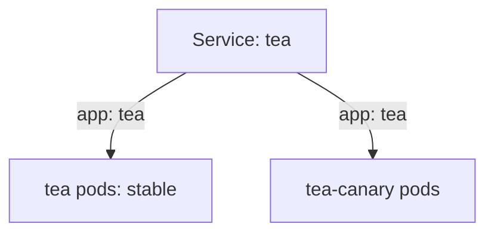

# Canary Traffic By Pod Count

A Service has no setting for "send 20% of traffic here". It spreads connections over every ready pod it selects. So the share of traffic a version gets is about the same as its share of the selected pods. This part shows how to turn a percentage into pod counts.

## Two Deployments, one Service

The example in this module runs one app as two Deployments on the same planet, with one Service in front.

### The objects

| Object | Pod labels | Role |
| --- | --- | --- |
| Deployment `tea` | `app=tea`, `track=stable` | The stable version |
| Deployment `tea-canary` | `app=tea`, `track=canary` | The canary: the scout group of new ships |
| Service `tea` | selector decides | The beacon both versions can answer |

Both versions carry `app=tea`. Only the `track` label tells them apart, like a different marking painted on the scouts' hulls.

### How the Service picks

A Service selector only matches pods that carry every label in it. If the selector is only `app: tea`, both Deployments' pods answer. If it is `app: tea` and `track: stable`, only the stable pods answer.

With the shared label only, the Service sends traffic to stable and canary pods alike.

## Turn a percentage into pods

Traffic percentage is approximated by matching Pod counts when all selected Pods are equivalent Service endpoints. Equivalent means each pod can take about the same load, so each gets about the same share of connections.

### A worked example

For 20 percent canary with 10 total Pods, use 2 canary Pods and 8 stable Pods. The Service selects all 10, and 2 out of 10 is 20%.

The general rule: canary pods = total pods × canary percentage, and stable pods = total pods − canary pods. The Service must select both tracks, so its selector uses only the shared label.

The split is approximate, not exact. The Service spreads connections, not individual requests, so a short test may show a share that is a bit off.

### Zero percent

For 0 percent canary, either scale canary to 0 or adjust the Service selector away from canary. The `tea-one` overlay in this module does both, for an explicit rollback: canary at 0 replicas, and a selector that also names `track: stable`.

### Think it through

Before you change anything, answer these three questions:

- Which overlay is prod?
- How many stable and canary Pods produce the target percentage?
- Should the Service select canary Pods?

## Common pitfalls

> [!WARNING]
> - **Getting the counts right but the selector wrong.** If the Service selects only `track: stable`, the canary gets nothing, whatever its replica count.
> - **Counting only the canary.** The percentage is canary pods divided by all selected pods, so the stable count matters as much.
> - **Expecting an exact split.** Pod counts give an approximate share of connections, not an exact share of requests.
