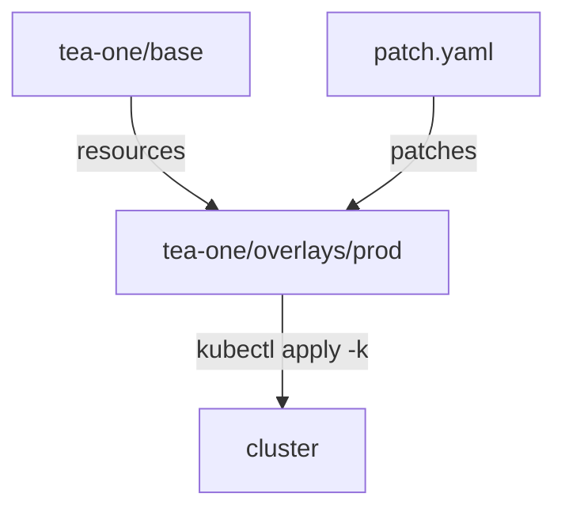

# Roll Back A Canary With An Overlay

Kustomize lets you keep one set of base files and lay small, environment-specific changes over them. This part builds a base and a prod overlay for the planet `tea-one`, where the canary must be rolled back completely: 4 total Pods, 0 percent traffic to canary.

## Base and overlay

Kustomize works with two layers. You write each layer as plain YAML files in folders, plus one `kustomization.yaml` per folder that lists them.

### What each layer is

- A **base** is the master star chart every mission starts from: the full objects, written once.
- An **overlay** is a clear sheet laid over the master chart, with this mission's changes drawn on it. It points at the base and adds **patches**.
- A **patch** is one change drawn on the sheet: a partial object with only the fields you want to change. Kustomize finds the object by its kind, name and namespace, and merges the fields.

Kustomize lets you keep a reusable base and apply environment-specific patches for rollout shape. Kustomize is built into `kubectl`: `kubectl kustomize` shows the combined result, and `kubectl apply -k` sends it to the cluster.



The prod overlay takes everything from the base, merges its patch on top, and `kubectl apply -k` sends the combined result to the cluster.

## Write the base

The base has three files in the folder `tea-one/base/`: the namespace, the app, and the list of both.

### Save the base files

Save this as `tea-one/base/namespace.yaml`:

```yaml
apiVersion: v1
kind: Namespace
metadata:
  name: tea-one
```

Save this as `tea-one/base/app.yaml`:

```yaml
apiVersion: apps/v1
kind: Deployment
metadata:
  name: tea
  namespace: tea-one
spec:
  replicas: 3
  selector:
    matchLabels:
      app: tea
      track: stable
  template:
    metadata:
      labels:
        app: tea
        track: stable
    spec:
      containers:
        - name: nginx
          image: nginx:1-alpine
---
apiVersion: apps/v1
kind: Deployment
metadata:
  name: tea-canary
  namespace: tea-one
spec:
  replicas: 1
  selector:
    matchLabels:
      app: tea
      track: canary
  template:
    metadata:
      labels:
        app: tea
        track: canary
    spec:
      containers:
        - name: nginx
          image: nginx:1-alpine
---
apiVersion: v1
kind: Service
metadata:
  name: tea
  namespace: tea-one
spec:
  type: NodePort
  selector:
    app: tea
  ports:
    - port: 80
      targetPort: 80
      nodePort: 30020
```

The base runs 3 stable pods and 1 canary pod, and its Service selects both tracks with `app: tea`. The Service type `NodePort` also opens port `30020` on every node, a fixed docking port on every launch pad that leads to the beacon.

Save this as `tea-one/base/kustomization.yaml`:

```yaml
resources:
  - namespace.yaml
  - app.yaml
```

## Write the prod overlay

The task for `tea-one`: 4 total Pods, 0 percent traffic to canary, full rollback. So set stable replicas to `4`, canary replicas to `0`, and make the Service select only stable Pods.

### Save the overlay files

Save this as `tea-one/overlays/prod/kustomization.yaml`:

```yaml
resources:
  - ../../base
patches:
  - path: patch.yaml
```

Save this as `tea-one/overlays/prod/patch.yaml`:

```yaml
apiVersion: apps/v1
kind: Deployment
metadata:
  name: tea
  namespace: tea-one
spec:
  replicas: 4
---
apiVersion: apps/v1
kind: Deployment
metadata:
  name: tea-canary
  namespace: tea-one
spec:
  replicas: 0
---
apiVersion: v1
kind: Service
metadata:
  name: tea
  namespace: tea-one
spec:
  selector:
    app: tea
    track: stable
```

The patch holds three partial objects. Kustomize merges each into the base object with the same kind, name and namespace. For the Service, it merges `track: stable` into the selector, so the result has both `app: tea` and `track: stable`.

## Render, apply and prove

Always look at the combined result before you send it. A wrong path or a typo in a patch name shows up here, not in the cluster.

### Render the overlay

```bash
kubectl kustomize tea-one/overlays/prod
```

Check the rendered output: `tea` has `replicas: 4`, `tea-canary` has `replicas: 0`, and the Service selector has both `app: tea` and `track: stable`.

### Apply and check

Apply it:

```bash
kubectl apply -k tea-one/overlays/prod
```

Then check the result:

```bash
kubectl -n tea-one get deploy,svc,pod --show-labels
```

You should see 4 `tea` pods with `track=stable`, no `tea-canary` pods, and the Service `tea`. When verification fails, do not immediately rerun the solution. First compare the live object with the expected object.

> [!TIP]
> If kustomize output is unexpected, render before applying. `kubectl kustomize <overlay>` costs nothing and shows exactly what `apply -k` will send.

## Common pitfalls

> [!WARNING]
> - **Applying the base instead of the overlay.** `kubectl apply -k tea-one/base` sends the base counts (3 and 1), not the prod ones.
> - **A patch that names the wrong object.** The kind, name and namespace in the patch must match the base object exactly, or Kustomize stops with an error.
> - **Scaling the canary to 0 but leaving the selector broad.** That works too, but the task asks for a full rollback; with both changes the canary cannot get traffic even if someone scales it up again.
