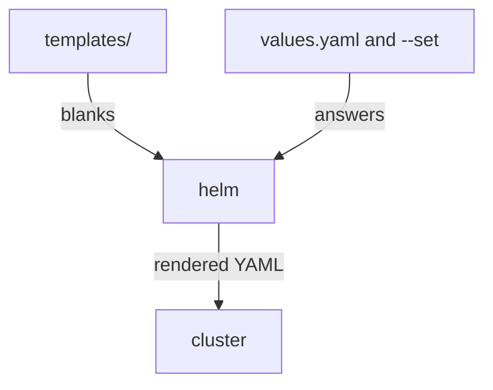

# What A Chart Is

A Helm chart is a folder of Kubernetes YAML with blanks in it, plus a file of default answers for the blanks. Helm fills the blanks and sends the result to the cluster. This part builds a small chart called `study-web` and looks at what it produces, before anything is installed.

## The parts of a chart

A chart is a ship kit: the parts, an order form, and a label on the box. Each one is a file in the chart folder.

### The four files

| File | Purpose |
| --- | --- |
| `charts/study-web/Chart.yaml` | Helm chart metadata |
| `charts/study-web/templates/deployment.yaml` | Template for the Deployment |
| `charts/study-web/templates/service.yaml` | Template for the Service |
| `charts/study-web/values.yaml` | Default Helm chart values |

- A **template** is a kit part with blanks. A blank looks like `{{ .Values.replicaCount }}`.
- **Values** are the options on the order form. `values.yaml` holds the defaults, and `--set` on the command line overrides one.
- A **release** is one installed copy of a chart, with its own name, in one namespace. `{{ .Release.Name }}` and `{{ .Release.Namespace }}` fill in from it.

Helm values let you change chart behavior without editing templates.



Helm, running on your computer, fills the templates with the values and sends the rendered YAML to the cluster.

## Write the chart

Make a folder `charts/study-web/` with a `templates/` folder inside, and save the four files.

### Save the chart files

Save this as `charts/study-web/Chart.yaml`:

```yaml
apiVersion: v2
name: study-web
description: Local chart for CKAD Helm practice
type: application
version: 0.1.0
appVersion: "1.31"
```

Save this as `charts/study-web/values.yaml`:

```yaml
replicaCount: 1
image:
  repository: nginx
  tag: 1.31-alpine
service:
  port: 80
```

Save this as `charts/study-web/templates/deployment.yaml`:

```yaml
apiVersion: apps/v1
kind: Deployment
metadata:
  name: {{ .Release.Name }}
  namespace: {{ .Release.Namespace }}
  labels:
    app.kubernetes.io/name: study-web
    app.kubernetes.io/instance: {{ .Release.Name }}
spec:
  replicas: {{ .Values.replicaCount }}
  selector:
    matchLabels:
      app.kubernetes.io/instance: {{ .Release.Name }}
  template:
    metadata:
      labels:
        app.kubernetes.io/name: study-web
        app.kubernetes.io/instance: {{ .Release.Name }}
    spec:
      containers:
        - name: nginx
          image: "{{ .Values.image.repository }}:{{ .Values.image.tag }}"
          ports:
            - containerPort: 80
```

Save this as `charts/study-web/templates/service.yaml`:

```yaml
apiVersion: v1
kind: Service
metadata:
  name: {{ .Release.Name }}
  namespace: {{ .Release.Namespace }}
  labels:
    app.kubernetes.io/name: study-web
    app.kubernetes.io/instance: {{ .Release.Name }}
spec:
  selector:
    app.kubernetes.io/instance: {{ .Release.Name }}
  ports:
    - port: {{ .Values.service.port }}
      targetPort: 80
```

Four values feed the templates: `replicaCount`, `image.repository`, `image.tag` and `service.port`. Every name comes from the release name.

## Check the chart before you install it

Two commands look at a chart without touching the cluster. Run them from the folder that holds `charts/`.

### Lint and render

```bash
helm lint charts/study-web
helm template study-web charts/study-web --set replicaCount=2
```

`helm lint` checks that the chart is well formed. `helm template` prints the YAML Helm would send, with `study-web` as the release name and `replicaCount` set to `2`. Look for `replicas: 2` and `image: "nginx:1.31-alpine"` in the Deployment.

### Think it through

Before you install, answer these three questions:

- Which fields are templated?
- Which values are overridden at install time?
- What changed between revisions?

You can answer the first two now from the templates and the `--set` flag. The last one you answer after the upgrade.

## Common pitfalls

> [!WARNING]
> - **Running Helm from the wrong folder.** If Helm cannot find the chart, check your path from the folder that holds `charts/`.
> - **Editing a template to change one number.** Set a value instead; that is what values are for.
> - **A value name that the chart does not use.** `--set replicas=2` does nothing here, because the template reads `replicaCount`. Read the templates or `values.yaml` first.
