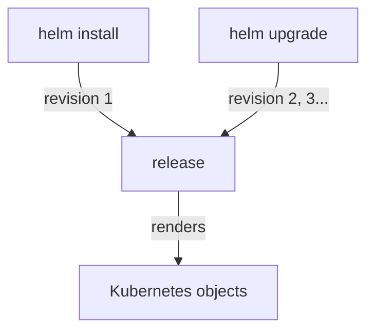

# Releases And Their States

Helm does not edit Kubernetes objects one by one. It works on releases, and the objects are what each release renders. This part shows what Helm keeps about a release, how to see every release on a planet, and how to find what a chart lets you change.

## Releases and revisions

A release is one kit, built and flying under its own name on one planet. Helm keeps a logbook for it.

### What Helm records

Helm stores each install or upgrade as a release revision, separate from raw Kubernetes object editing. Each revision records the chart version, the values and a state.

- `helm install` creates a new release (revision 1).
- `helm upgrade` changes an existing one (a new revision).
- `helm uninstall` removes the release and the objects it created.



Helm actions change the release; the Kubernetes objects follow from what the release renders.

### Release states

A release that worked shows the state `deployed`. Other states show a release that did not finish or was replaced, for example `failed`, `superseded` or `pending-install`. A release in `pending-install` is a kit stuck half-built on the launch pad: its install started and never finished.

`helm list` shows only deployed and failed releases by default. `helm list --all` shows releases in non-deployed states, including `pending-install`.

## The chart repository

A chart repository is the kit catalogue depot you order kits from. You add it to Helm once, by name and address.

### Add the repository

Add the chart repository if your environment provides it:

```bash
helm repo add study-charts https://example.invalid/charts
helm repo update
```

Replace the URL with the chart repository available in your training cluster. After that, its charts have names like `study-charts/nginx` and `study-charts/apache`. `helm repo update` fetches the depot's latest catalogue.

## Read before you act

Before solving, inspect what already exists. This builds the habit you need during the exam.

### Inspect the releases and the chart

```bash
helm -n birch list --all
helm -n birch history internal-issue-report-apiv2
helm show values study-charts/apache
```

Look for these details:

- Correct namespace
- Existing labels and selectors
- Current images, replicas, ports, or mounted resources
- Events that explain pending, failed, or rejected resources

### Values differ from chart to chart

Values vary by chart. Common keys are `replicaCount` or `replicas`; inspect defaults when unsure:

```bash
helm show values study-charts/apache
```

A value name the chart does not use is usually ignored without an error (unless the chart ships a values schema), so reading the defaults first saves you a wrong install.

## Common pitfalls

> [!WARNING]
> - **Listing without `--all`.** A release stuck in `pending-install` does not show in a plain `helm list`.
> - **Guessing value names.** One chart reads `replicaCount`, another `replicas`. Read `helm show values` first.
> - **Forgetting `helm repo update`.** Without it, Helm may not know about the newest chart versions in the repository.
